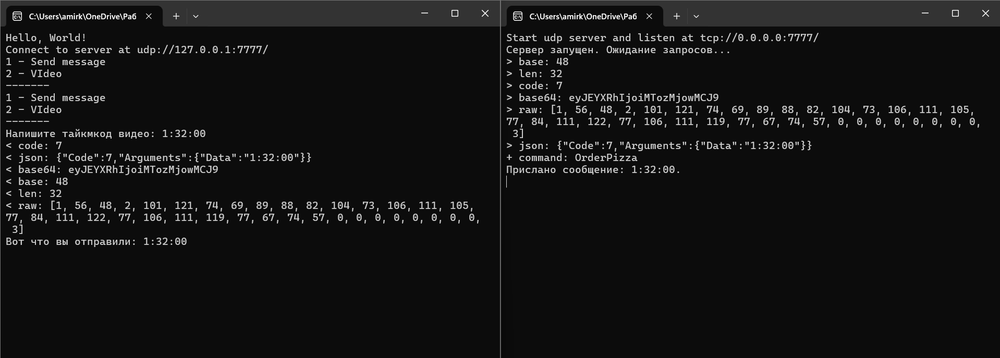

## Объяснение кода

### 1. Работа с TCP

#### Что такое TCP?

**TCP (Transmission Control Protocol)** — это протокол транспортного уровня, который обеспечивает надежную, последовательную и ориентированную на соединение передачу данных между устройствами. TCP гарантирует доставку данных без потерь и в правильном порядке, что делает его идеальным для приложений, где важна целостность данных (например, веб-запросы, отправка файлов, базы данных).

#### Примеры методов с использованием TCP

В данном проекте используется объект `netTcpClient`, который отправляет команды на сервер по протоколу TCP. Ниже приведены примеры методов для работы с пользователями (`User`):

- **Добавление пользователя (`AddAsync`)**:
  ```csharp
  public async Task<bool> AddAsync(User newUser)
  {
      var command = new Command() { 
          Code = (byte)CommandCode.AddUser,
          Arguments = new Dictionary<string, object?>() 
          {
              ["Data"] = newUser
          }
      };

      var result = await netTcpClient.SendAsync(command);

      if (null == result)
      {
          return false;
      }

      var addResult = result.Arguments["Data"]?.ToString();
      bool.TryParse(addResult, out var addResultValue);
      
      return addResultValue;
  }
  ```
  - Метод отправляет команду на сервер для добавления нового пользователя.
  - Команда содержит код операции (`CommandCode.AddUser`) и аргументы (`Data` — объект `User`).
  - Результат от сервера преобразуется в логическое значение (`true` или `false`).

- **Удаление пользователя (`DeleteAsync`)**:
  ```csharp
  public async Task<bool> DeleteAsync(int id)
  {
      var command = new Command()
      {
          Code = (byte)CommandCode.DeleteUser,
          Arguments = new Dictionary<string, object?>()
          {
              ["Id"] = id
          }
      };

      var result = await netTcpClient.SendAsync(command);

      if (result == null)
      {
          return false;
      }

      var deleteResult = result.Arguments["Data"]?.ToString();
      bool.TryParse(deleteResult, out var deleteResultValue);

      return deleteResultValue;
  }
  ```
  - Метод отправляет команду на сервер для удаления пользователя по его идентификатору (`Id`).
  - Результат от сервера также преобразуется в логическое значение.

- **Получение всех пользователей (`GetAllAsync`)**:
  ```csharp
  public async Task<User[]> GetAllAsync()
  {
      var command = new Command() { 
          Code = (byte)CommandCode.ReadAllUsers
      };

      var result = await netTcpClient.SendAsync(command);

      if (null == result)
      {
          return Array.Empty<User>();
      }

      var usersJson = result.Arguments["Data"]?.ToString();
      return usersJson != null ? 
          JsonSerializer.Deserialize<User[]>(usersJson)! : 
          Array.Empty<User>();
  }
  ```
  - Метод отправляет команду на сервер для получения списка всех пользователей.
  - Результат от сервера представляет собой JSON-строку, которая десериализуется в массив объектов `User`.

- **Получение пользователя по ID (`GetAsync`)**:
  ```csharp
  public async Task<User?> GetAsync(int id)
  {
      var command = new Command() { 
          Code = (byte)CommandCode.ReadUser, 
          Arguments = new Dictionary<string, object?>() {
              ["Id"] = id
          }
      };

      var result = await netTcpClient.SendAsync(command);

      if (null == result)
      {
          return null;
      }

      var userJson = result.Arguments["Data"]?.ToString();
      return userJson != null ? 
          JsonSerializer.Deserialize<User>(userJson) : null;
  }
  ```
  - Метод отправляет команду на сервер для получения пользователя по его идентификатору.
  - Результат от сервера десериализуется в объект `User`.

- **Обновление пользователя (`UpdateAsync`)**:
  ```csharp
  public async Task<bool> UpdateAsync(int id, User updateUser)
  {
      var command = new Command()
      {
          Code = (byte)CommandCode.UpdateUser,
          Arguments = new Dictionary<string, object?>()
          {
              ["Id"] = id,
              ["Data"] = updateUser
          }
      };

      var result = await netTcpClient.SendAsync(command);

      if (result == null)
      {
          return false;
      }

      var updateResult = result.Arguments["Data"]?.ToString();
      bool.TryParse(updateResult, out var updateResultValue);

      return updateResultValue;
  }
  ```
  - Метод отправляет команду на сервер для обновления данных пользователя.
  - Результат от сервера преобразуется в логическое значение.

---

### 2. Работа с UDP

#### Что такое UDP?

**UDP (User Datagram Protocol)** — это протокол транспортного уровня, который обеспечивает быструю, но менее надежную передачу данных. UDP не устанавливает соединение между устройствами, не проверяет доставку данных и не гарантирует их порядок. Это делает UDP идеальным для приложений, где важна скорость передачи данных, а не их целостность (например, потоковое видео, онлайн-игры, VoIP).

#### Пример метода с использованием UDP

- **Отправка сообщения по UDP (`OrderVideo`)**:
  ```csharp
  public async Task<bool> OrderVideo(string pizzaType)
  {
      var command = new Command()
      {
          Code = (byte)CommandCode.OrderPizza,
          Arguments = new Dictionary<string, object?>()
          {
              ["Data"] = pizzaType
          }
      };

      await netUdpClient.SendAsync(command);
      return true;
  }
  ```
  - Метод отправляет сообщение на сервер по протоколу UDP.
  - Команда содержит код операции (`CommandCode.OrderPizza`) и аргументы (`Data` — строка с типом видео).
  - Отправка происходит без ожидания ответа от сервера, так как UDP не гарантирует доставку.

- **Обработка ввода пользователя**:
  ```csharp
  if (key.Key == ConsoleKey.D2) 
  {
      Console.Write("Напишите таймкод видео: ");
      var weatherType = Console.ReadLine() ?? string.Empty;
      await messageApi.OrderVideo(weatherType);
      Console.WriteLine($"Вот что вы отправили: {weatherType}");
  }
  ```
  - Этот код обрабатывает ввод пользователя через консоль.
  - Если пользователь выбрал опцию "2", он вводит таймкод видео, который отправляется на сервер через метод `OrderVideo`.

---


## Работа программы
### TCP

### UDP
