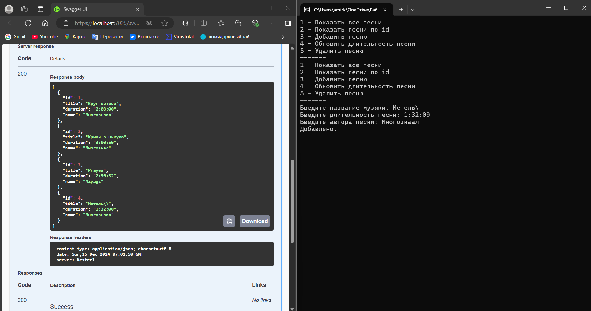

# README.md

## Описание проекта

Данный проект реализует HTTP-соединение и нацелен на передачу информации о музыке. Он состоит из клиентской и серверной частей, которые взаимодействуют через REST API. Клиентская часть предоставляет консольное меню для управления информацией о музыкальных композициях, а серверная часть обрабатывает запросы и предоставляет данные.

---

## Основные функции

### 1. Модель данных

Модель `TaskItem` представляет собой информацию о музыкальной композиции:

```csharp
public class TaskItem
{
    public TaskItem()
    {
    }

    public TaskItem(int id, string title, string duration, string name)
    {
        Id = id;
        Title = title;
        Duration = duration;
        Name = name;
    }

    public int Id { get; set; }
    public string Title { get; set; } = string.Empty;
    public string Duration { get; set; } = string.Empty;
    public string Name { get; set; } = string.Empty;
}
```

- **Id**: Уникальный идентификатор композиции.
- **Title**: Название музыкальной композиции.
- **Duration**: Длительность композиции.
- **Name**: Имя автора композиции.

---

### 2. Клиентская часть

Клиентская часть реализована в классе `Program` и предоставляет консольное меню для взаимодействия с сервером.

#### Основные функции:

- **Получение всех композиций**:
  ```csharp
  if (key.Key == ConsoleKey.D1)
  {
      var tasks = await taskApi.GetAllAsync();
      Console.WriteLine($"| Id    |        Title of music       |   Description      |         Name             |");
      foreach (var task in tasks)
      {
          Console.WriteLine($"| {task.Id,5} | {task.Title,15} | {task.Duration,20} | {task.Name,10} |");
      }
  }
  ```
  - Получает список всех композиций с сервера и выводит их в консоль.

- **Получение композиции по ID**:
  ```csharp
  if (key.Key == ConsoleKey.D2)
  {
      Console.Write("Введите id музыки: ");
      var taskIdString = Console.ReadLine();
      int.TryParse(taskIdString, out var taskId);
      var task = await taskApi.GetAsync(taskId);
      if (task == null)
      {
          Console.WriteLine("Не найдена.");
      }
      else
      {
          Console.WriteLine($"| {task.Id,5} | {task.Title,15} | {task.Duration,20} | {task.Name,10} |");
      }
  }
  ```
  - Получает композицию по её идентификатору и выводит информацию в консоль.

- **Добавление новой композиции**:
  ```csharp
  if (key.Key == ConsoleKey.D3)
  {
      Console.Write("Введите название музыки: ");
      var title = Console.ReadLine() ?? "Без названия";
      Console.Write("Введите длительность песни: ");
      var addduration = Console.ReadLine() ?? "Без описания";
      Console.Write("Введите автора песни: ");
      var addName = Console.ReadLine() ?? "Без описания";
      var newTask = new TaskItem(
          id: 0,
          title: title,
          duration: addduration,
          name: addName
      );

      var addResult = await taskApi.AddAsync(newTask);
      Console.WriteLine(addResult ? "Добавлено." : "Ошибка добавления.");
  }
  ```
  - Позволяет добавить новую композицию, запрашивая у пользователя название, длительность и имя автора.

- **Обновление длительности композиции**:
  ```csharp
  if (key.Key == ConsoleKey.D4)
  {
      Console.Write("Введите id песни: ");
      var taskIdString = Console.ReadLine();
      int.TryParse(taskIdString, out var taskId);
      var task = await taskApi.GetAsync(taskId);
      if (task == null)
      {
          Console.WriteLine("Не найдена.");
          continue;
      }

      Console.Write("Введите длительность песни: ");
      var descrip = Console.ReadLine() ?? "Новая";
      task.Duration = descrip;

      var updateResult = await taskApi.UpdateAsync(taskId, task);
      Console.WriteLine(updateResult ? "Обновлено." : "Ошибка обновления.");
  }
  ```
  - Позволяет обновить длительность композиции по её идентификатору.

- **Удаление композиции**:
  ```csharp
  if (key.Key == ConsoleKey.D5)
  {
      Console.Write("Введите id песни: ");
      var taskIdString = Console.ReadLine();
      int.TryParse(taskIdString, out var taskId);

      var deleteResult = await taskApi.DeleteAsync(taskId);
      Console.WriteLine(deleteResult ? "Удалена." : "Ошибка удаления.");
  }
  ```
  - Позволяет удалить композицию по её идентификатору.

- **Выход из программы**:
  ```csharp
  if (key.Key == ConsoleKey.Escape)
  {
      break;
  }
  ```

---

### 3. Серверная часть

Серверная часть реализована с использованием ASP.NET Core и предоставляет REST API для обработки запросов.

#### Основные компоненты:

- **Настройка сервисов**:
  ```csharp
  var builder = WebApplication.CreateBuilder(args);

  builder.Services.AddScoped<IDataSerializer<TaskItem[]>, JsonDataSerializer<TaskItem[]>>();
  builder.Services.AddScoped<ITaskApi, TaskStorage>();

  builder.Services.AddControllers();
  builder.Services.AddEndpointsApiExplorer();
  builder.Services.AddSwaggerGen();
  ```
  - Регистрация зависимостей, включая сериализатор данных и хранилище задач.

- **Настройка HTTP-запросов**:
  ```csharp
  var app = builder.Build();

  if (app.Environment.IsDevelopment())
  {
      app.UseSwagger();
      app.UseSwaggerUI();
  }

  app.UseHttpsRedirection();
  app.MapControllers();
  app.Run();
  ```
  - Настройка Swagger для документации API и перенаправление HTTP на HTTPS.

---

## Работа программы
